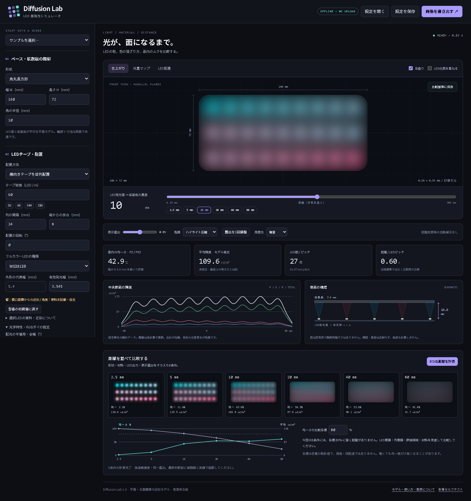

# Diffusion Lab

フルカラーLEDと拡散板の組み合わせを、ブラウザで比較する設計ツールです。
LEDと拡散板の距離、LEDの並べ方、板の形状や材料の条件を変えて、光の粒・明るさのむら・色の混ざり方を確認できます。

面発光パネルやLED装飾の試作前に、比較したい条件を絞り込むために使えます。
インストールやアカウント登録は不要で、計算はブラウザ内で行います。



## できること

| 機能 | 比較・確認できること |
|---|---|
| 拡散板の形状設定 | 長方形、角丸長方形、円・楕円、円環・楕円環、多角形の寸法と輪郭 |
| LEDの配置設定 | 複数の直線テープ、正方格子、輪郭、円周、自由な折れ線経路、LEDの個別配置 |
| LEDの条件設定 | 密度、5050 / 3535 / 2020 / 任意サイズ、有効発光幅、RGB光度、配光 |
| 色と点灯パターン | 単色、2色グラデーション、2色交互、虹色、RGB繰り返し、出力調整 |
| 材料の条件設定 | 材料色、厚さ、透過率、拡散成分比、内部にじみ係数 |
| 距離の一括比較 | 2.5 / 5 / 10 / 20 / 40 / 80 mm の6条件を同じ露出で比較 |
| 表示と評価 | 仕上がり画像、光量マップ、LED配置、光量分布のグラフ、均一さ、モデル推定の平均輝度 |
| A/B比較 | 現在の結果を基準として保持し、変更後の条件と比較 |
| 保存と書き出し | 設定JSONの保存・読み込み、条件付きPNG画像、光量データCSV |

LED発光面から拡散板裏面までの距離は **0.25〜300 mm**、板の幅・高さは **10〜2,000 mm**、LEDは最大 **5,000個**まで設定できます。

## 使い始める

公開サイトでは、アプリを開くとそのまま操作できます。
手元で使う場合は、このリポジトリをダウンロード・展開して、ルートの **`index.html`** をブラウザで開いてください。
アプリの利用にPython・Node.js・npm・APIキーは不要です。

1. 左上のサンプルから「LEDの粒を見る」または「面の均一さを見る」を選びます。
2. 板の大きさ、LEDの密度・配置、材料の条件を設定します。
3. LEDと拡散板の距離を変え、仕上がりを確認します。
4. **「6つの距離を計算」**を押して、距離による違いを比較します。
5. 気になる条件を**「比較基準に保存」**し、配置や材料を変えてA/B比較します。

比較中は表示露出をそろえてください。「露出を1回調整」は、その時点の条件に合わせて明るさを調整します。
6距離比較は高速解像度で計算するため、候補の距離を選んだら高精細でも確認してください。

詳しい操作方法は [操作ガイド](docs/USAGE.md) を参照してください。

### サンプル設定

[examples/](examples/) に、細い白色LEDテープ、白色パネル、2020 LEDの円環、厚さ3 mmのフォーム、混色比較の5件のJSON設定を用意しています。
サンプルJSONをダウンロードし、アプリの**「設定を開く」**で読み込むと、条件を変更しながら試せます。

## 結果の読み方

- **仕上がり**：画面上での見え方の近似です。表示露出によって明るさが変わります。
- **光量マップ**：光の分布を疑似色で表示します。画像ごとに色のスケールが変わるため、条件間の絶対的な明るさの比較には平均輝度を使ってください。
- **均一さ**：評価領域の暗い側5%点と明るい側95%点の比（P5 / P95）です。100%に近いほど明るさが均一ですが、色むらや必要な明るさを保証する指標ではありません。
- **平均輝度**：モデルが推定した値です。表示露出の影響を受けませんが、実測値としては扱えません。

距離を離すことで光の粒が目立ちにくくなっても、明るさが低下する場合があります。均一さと明るさをあわせて比較してください。
6距離比較で示す目標到達距離は、試した6条件の中の結果であり、厳密な最小必要距離ではありません。

## モデルの範囲と注意点

**本アプリは実測校正前の設計比較モデルです。実物の見え方や測光値を保証するものではありません。**

LED面と拡散板が平行で、正面から観察する条件を扱います。材料・LEDのプリセットは比較用の仮定値で、実在製品の測定値ではありません。
5050 / 3535 / 2020 は外形サイズの選択であり、製品ごとの光度や配光の違いは別途設定してください。

曲面、傾いた板、側壁・背面の反射、導光板、遮蔽物、屈折、厳密な多重散乱、材料の分光透過などは対象外です。
透明・弱拡散材や極端な近距離では誤差が大きくなります。最終的な寸法・材料・LEDの選定は実物で確認してください。

材料色のARGBに含まれる **Aは「着色の強さ」**で、透過率ではありません。透過率と拡散の条件は独立して設定します。
計算式と詳しい限界は [計算モデル](docs/MODEL.md) にまとめています。

## データの保存と動作環境

設定入力と計算はブラウザ内で処理し、入力や計算結果を自動的に外部へ送信しません。
最後の設定は、利用可能な環境では同じブラウザ内に自動保存します。大切な設定はJSONでも保存してください。
A/B比較の基準は、ページを閉じると失われます。

JavaScriptとWeb Workerが利用できるデスクトップブラウザを想定しています。スマートフォン向けには設定欄を折りたたむ表示もあります。
保存した単独HTMLはオフラインでも使用できます。公開URLのオフライン再読み込みには対応していません。

ローカルHTMLの直接実行が制限される環境では、Pythonが利用できる場合に次のコマンドで起動できます。

```sh
python -m http.server 8000 --bind 127.0.0.1
```

ブラウザで `http://localhost:8000/` を開いてください。

## 開発・公開について

ソースは `src/` にあり、`python build.py` で単独HTMLと公開用ファイルを生成します。
詳しい手順は以下のガイドを参照してください。

- [開発ガイド](docs/DEVELOPMENT.md)：ソース構成、ビルド、テスト
- [公開ガイド](docs/DEPLOYMENT.md)：GitHub Pagesへの公開とトラブル対処
- [検証記録](docs/TEST_REPORT.md)：実施済みの検証とその範囲

## ライセンス

このリポジトリには現時点でライセンスを指定していません。
利用・改変・再配布の許諾条件については、リポジトリの管理者に確認してください。
